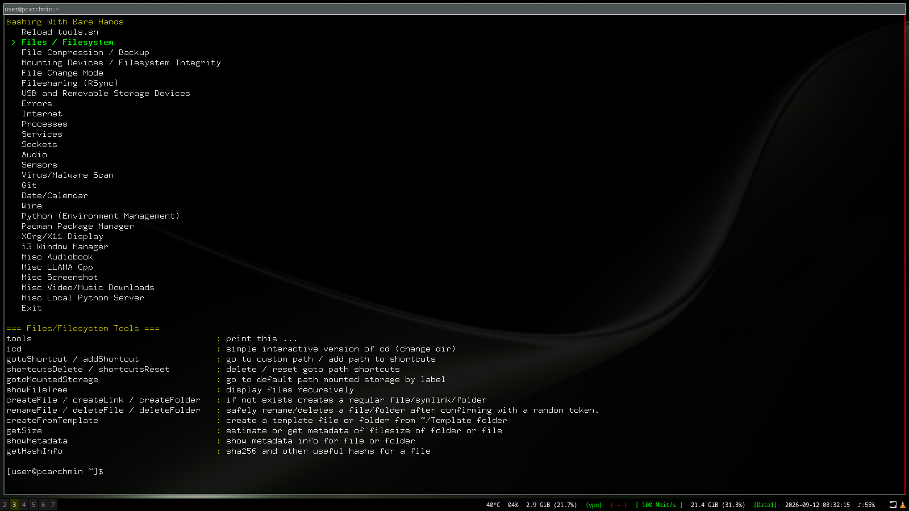

# Bashing With Bare Hands 

Designed for minimalist linux setups, this repository is a collection of aliases/functions for linux desktop terminal. In contrast to the legacy pattern of linux and unix system, they should be easy to remember and be used with autocompletion, so the commands are verbose.

The majority of commands display the following behaviour:
1. The script when sourced display a small inventory of their functions/aliases.
2. Their functions prompts the user with confirmation token or simple confirmation for critical or irreversible modifications.
3. Their functions display usage help and useful information when used with no arguments.
4. Colors for contrast.

The main goal for this project is to make minimal setup linux environments easy to manage using only terminal interface. Many of the tools still require third-party cli tools, so read it and install the necessary packages for your system.

## Usage

Please read the dependencies to see if you can use it, as it relies primarily on other cli programs, this is just a user interface wrapper of existing commands. The dependencies are listed on script itself.

```bash
# -- BashingWithBareHands
# ... add this to your aliases script (.bash_aliases or .bashrc)
TOOLBOX="PATH_TO/Toolbox" # modify me, actual path of Toolbox folder 
source $TOOLBOX/tools.sh 2&> /dev/null
```

Just add the script above to your preferred aliases file `.bash_aliases`, source the `.bash_aliases` again or re-open the terminal to import the `tools.sh` script. You can create aliases pointing directly to a specific file or use `bmenu` to select the toolbox interactively.


