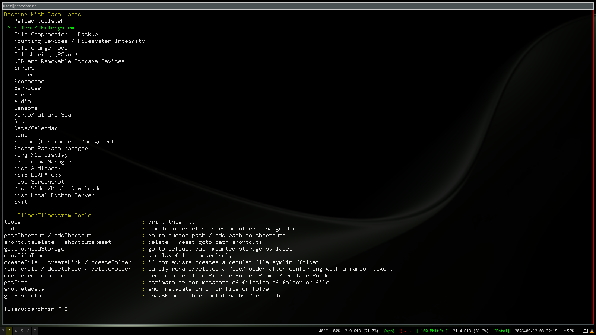

# Bashing With Bare Hands 

Designed for minimalist linux setups, this repository is a collection of aliases and functions for the Linux desktop terminal. In contrast to legacy patterns, they are designed to be easy to remember, verbose, and integrated with autocompletion.

The majority of commands display the following behavior:
1. When sourced, the script displays a small inventory of its functions and aliases.
2. Critical or irreversible modifications prompt the user with a confirmation token or simple confirmation.
3. Functions display usage help and useful information when called with no arguments.
4. Colors are used for contrast.

The main goal is to make minimal setup Linux environments easy to manage using only the terminal interface. Many tools require third-party CLI packages, so check the documentation and install the necessary dependencies for your system.

## Usage

### 1. Standard (Non-Protected) Setup
To use the Toolbox in standard mode, add the configuration to your `.bash_aliases` or `.bashrc` file:

```bash
# -- BashingWithBareHands
TOOLBOX="$HOME/Toolbox" # Modify to the actual path of your Toolbox folder 
source "$TOOLBOX/tools.sh" >/dev/null
```

You can create aliases pointing directly to specific script files (e.g., `source $TOOLBOX/<toolscript>`) or use `bmenu` to select from the toolbox interactively.

### 2. Secure Mode: Cryptographic Hash Tampering Detection

To protect your shell toolbox against unauthorized modification or tampering, you can enable the root-protected security core and automated integrity checks.

#### Component Installation & Setup

1. **Security Core:** Place the core security script into protected system storage (e.g., `/var/lib/script_security/bwbh_security_core.sh`). You should create it first it absent and update the paths on those scripts if putting elsewhere.

**You should read those files at least once, before putting anything on protected system folders. They are well commented, so any one could read and verify. Or you can inspect those files with LLMs.**

2. **Profile Hook:** Configure your system profile or shell initialization to hook into `bwbh_enforce.sh` (for instance, by placing it in `/etc/profile.d/`). This will automatically audit your files when the shell starts up.

**BEWARE! If these functions detect any modification to your `.bash_aliases`, they will output a warning in the terminal but will not halt the .bash_aliases loading. You should audit the .bash_aliases on any modification and for full protection lock it from modification or change how .bash_aliases is loaded.**

3. **Safe Sourcing in Aliases (`_template_bash_aliases_snippet`):** Instead of standard sourcing, use `__SCRIPT_SAFE_SOURCE` to verify script hashes on load:

```bash
TOOLBOX_DIR="$HOME/Toolbox"
__SCRIPT_SAFE_SOURCE "$TOOLBOX_DIR/filesystem_tools.sh" >/dev/null
__SCRIPT_SAFE_SOURCE "$TOOLBOX_DIR/tools.sh" >/dev/null
```

#### Auditing and Updating Baselines

To traverse your toolbox folder, audit script integrity via `sha256sum`, and interactively generate or update cryptographic baselines, run the update script:

**Please on bwbh_update_baseline.sh, modify the TOOLBOX_DIR variable to the actual path of the Toolbox folder. You can place and run this script anywhere after this.**

```bash
bash bwbh_update_baseline.sh
```

If a protected script file was modified, using `__SCRIPT_SAFE_SOURCE <script>` will detect and block the sourcing, but it will not protect from regular sourcing `source <script>` or `. <script>`.

```bash
# To manually update a baseline hash for a specific file:
__SCRIPT_BASELINE_UPDATE "/path/to/script.sh"
```

## Configuration Files & Cleanup

These tools write configuration files to `~/.config/BashingWithBareHands`. Some protected folders (such as integrity baseline storage under `/var/lib/script_integrity`) utilize `+a` (append-only) and `+i` (immutable) file attributes for enhanced security. You must remove these attributes using `chattr` if you ever need to clear or delete them.


